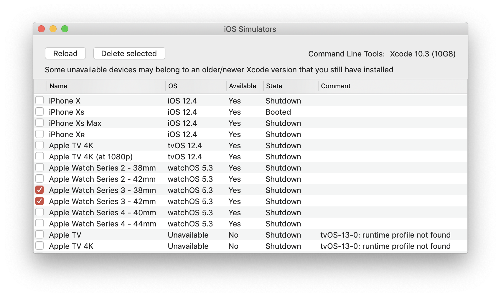

# SimBatchDelete

SimBatchDelete (temporary name) is a macOS app that makes it simple to delete all the Xcode simulator devices you don't need.

It is made as a GUI on top of `simctl` Xcode command.

- __Requirement__: macOS 10.12 Sierra or later

## Installation

Currently the only way to run the app is to download the source code and build the app with Xcode.

## Usage

Run the app, check all the devices you no longer need and press 'Delete selected' button.

## Source Code

- macOS 10.14 Mojave
- Xcode 11.1
- Swift 5.1
- Sandbox disabled

## How to Build

1. Open `SimBatchDelete.xcodeproj` in Xcode.
2. Build.

## Feedback

Feature requests, bug reports and improvement suggestions are welcome here, in GitHub Issues.
